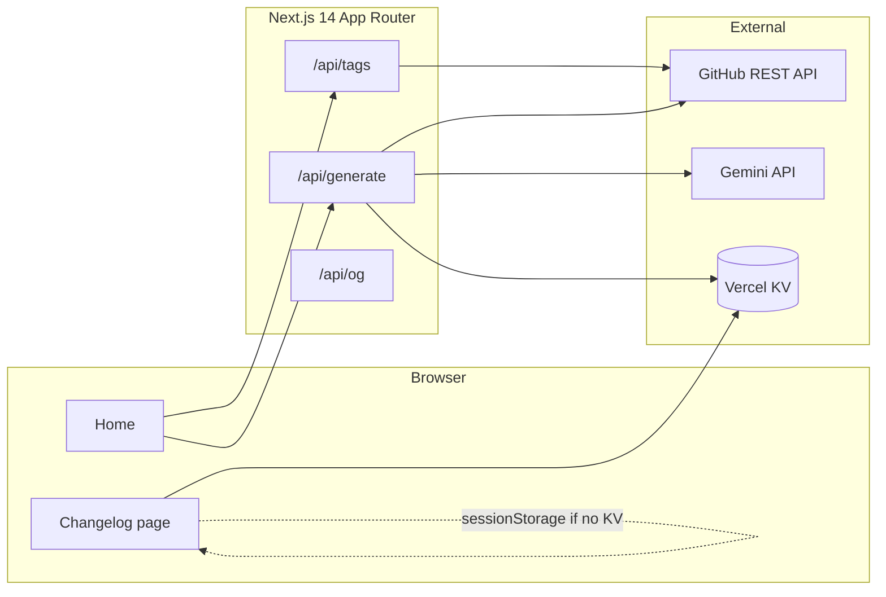

# RepoReel

**Live demo:** [repo-reel.vercel.app](https://repo-reel.vercel.app/)

RepoReel turns a public GitHub repository’s changes **between two version tags** into a **visual, shareable changelog**—think “Spotify Wrapped” for releases. It fetches commits via the GitHub API, categorizes them locally, asks Google Gemini for a short narrative (summary + highlight), caches the result, and renders an animated page you can link or embed.

---

## The problem

Maintainers rarely enjoy writing release notes, and default GitHub compare views are plain text. RepoReel gives you a **structured, on-brand story** for a tag range, with **stats**, **categories** (features, fixes, breaking, performance, dev experience), and a **highlight**—without pasting hundreds of commit messages into an LLM.

---

## What it does

- **Input:** GitHub repo (`owner/repo` or URL) + **From** / **To** tags (older → newer).
- **GitHub:** Lists tags, compares commits between refs, derives contributor and file stats.
- **Local parsing:** Commits are filtered (noise like merge commits, version-only lines) and **bucketed by convention** (feat/fix, etc.) to save tokens.
- **Gemini:** One small call per generation for a **2-sentence summary** and **highlight** only—**not** full commit text.
- **Cache:** Responses can be stored in **Vercel KV** (Redis) so share URLs load fast without re-running GitHub + Gemini.
- **Sharing:** Route `/r/[owner]/[repo]/[range]`, copy link / embed, **Open Graph** images via `@vercel/og`.

---

## Architecture (high level)



- **Frontend:** Next.js, TypeScript, Tailwind, Framer Motion, server + client components.
- **Backend:** Same app; route handlers orchestrate GitHub + Gemini + KV.
- **Optional:** KV missing in dev; the client can still open the changelog after generate using **sessionStorage** for that session.

---

## Repository layout

| Path | Role |
|------|------|
| `app/page.tsx` | Home: repo + tags + generate |
| `app/r/[owner]/[repo]/[range]/page.tsx` | Changelog view + `generateMetadata` (OG/Twitter) |
| `app/api/tags/[owner]/[repo]/route.ts` | List tags |
| `app/api/generate/route.ts` | Compare, parse, Gemini, KV write |
| `app/api/og/route.tsx` | Dynamic 1200×630 social image |
| `components/Changelog/*` | Header, stats, highlight, categories, share bar |
| `components/HomePage/*` | Hero, examples |
| `lib/github.ts` | Octokit: tags, compare |
| `lib/parser.ts` | Noise filter, categorization, mini summary for Gemini |
| `lib/gemini.ts` | Narrative JSON from Gemini |
| `lib/cache.ts` | KV get/set |
| `lib/range.ts` | Encode/decode `from--to` in URL |

---

## Tech stack

| Layer | Choices |
|--------|---------|
| Framework | Next.js 14 (App Router), TypeScript |
| Styling | Tailwind CSS |
| Motion | Framer Motion |
| GitHub | `@octokit/rest` |
| AI | `@google/generative-ai` (Gemini Flash family) |
| Cache | `@vercel/kv` |
| Social cards | `@vercel/og` (Edge) |

---

## Environment variables

| Variable | Required | Purpose |
|----------|----------|---------|
| `GEMINI_API_KEY` | Yes (for AI summary) | Google AI Studio / Gemini API |
| `GITHUB_TOKEN` | No | Higher GitHub rate limits (5000/hr vs ~60/hr public) |
| `KV_REST_API_URL` + `KV_REST_API_TOKEN`, or **`UPSTASH_REDIS_REST_URL` + `UPSTASH_REDIS_REST_TOKEN`** | No | Redis cache (e.g. [Upstash for Redis](https://vercel.com/marketplace) on Vercel Storage). RepoReel accepts either naming. Omit in local dev if you rely on sessionStorage. |
| `NEXT_PUBLIC_SITE_URL` | No | Canonical site URL for OG/metadata (e.g. `https://repo-reel.vercel.app`); Vercel sets `VERCEL_URL` automatically |

Copy `.env.local` locally (not committed):

```bash
GEMINI_API_KEY=your_key
GITHUB_TOKEN=ghp_optional
# Optional KV + site URL when deploying
```

---

## Local development

Install dependencies and run the dev server:

```bash
npm install
npm run dev
```

Open [http://localhost:3000](http://localhost:3000). Enter a public repo (e.g. `facebook/react`), pick **From** / **To** tags (older → newer), then **Generate changelog**.

**Sanity checks**

- `npm run build` — production build must pass.
- `npm run lint` — ESLint.
- Generate a small range; confirm redirect to `/r/owner/repo/from--to` and that stats + categories render.

---

## Deployment (Vercel)

1. Connect the GitHub repo to Vercel.
2. Set **Environment variables** in the dashboard: at minimum `GEMINI_API_KEY`; add `GITHUB_TOKEN` and KV for production traffic.
3. In **Storage** → **Marketplace** → **Upstash for Redis** → **Create**, then **link** the database to this project. Vercel injects REST credentials (often `KV_REST_*` or `UPSTASH_REDIS_*`). Redeploy so the server can read/write the cache.
4. Optionally set `NEXT_PUBLIC_SITE_URL` to your production domain for consistent OG URLs.

---

## Built with

Next.js · React · TypeScript · Tailwind CSS · Framer Motion · Octokit · Google Gemini · Vercel KV · Vercel OG
