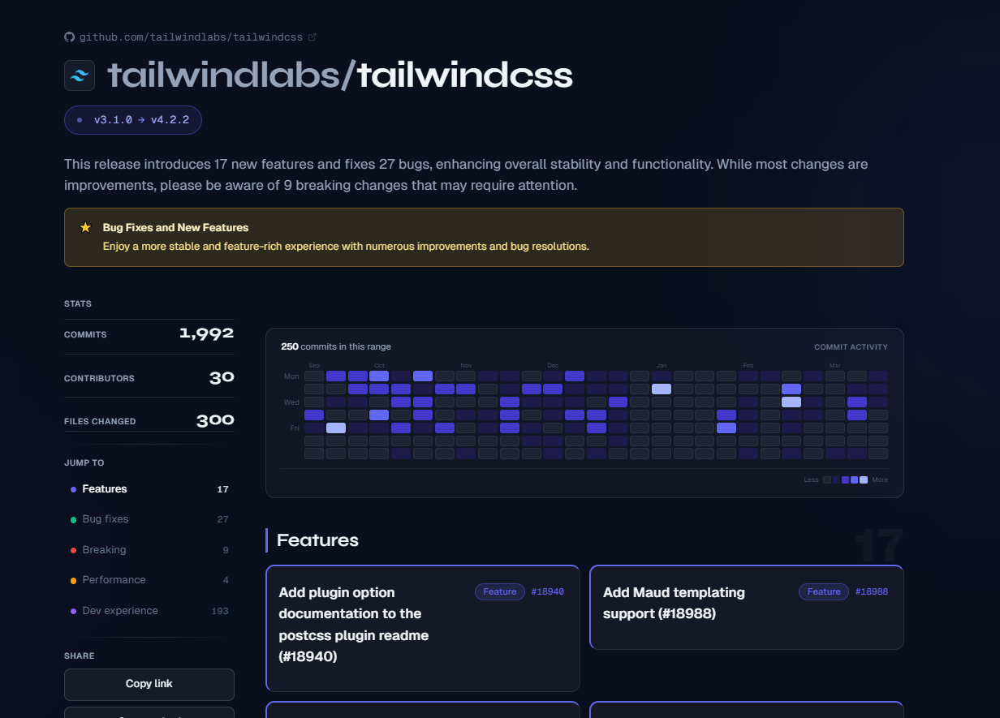
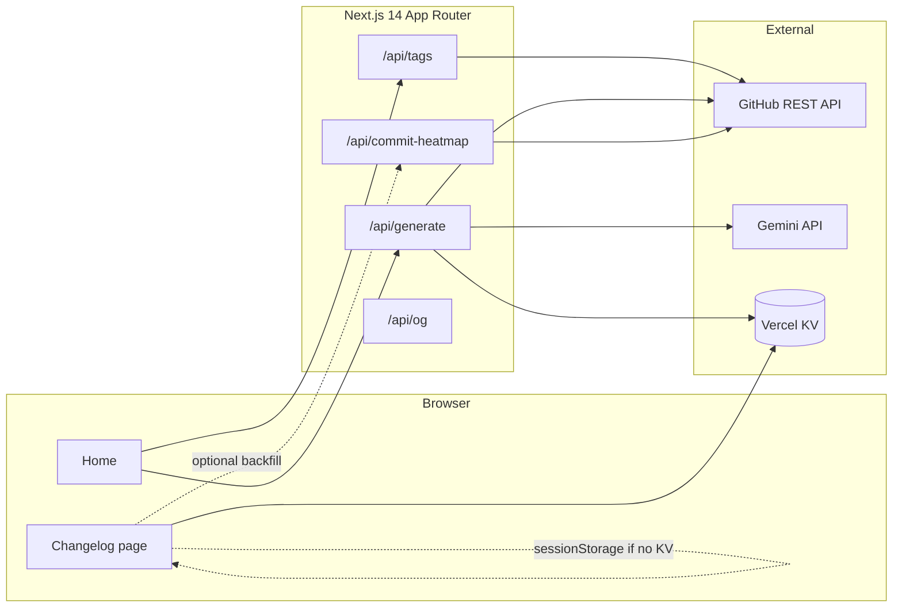

# RepoReel

> **Spotify Wrapped for software releases.** Turn any public GitHub repo's changes between two version tags into a beautiful, shareable visual changelog.

**Live demo:** [repo-reel.vercel.app](https://repo-reel.vercel.app/)



---

## The problem

Writing release notes is universally hated. GitHub's default compare view is plain text. RepoReel gives maintainers and teams a **structured, visual story** for any tag range — with stats, categorized changes, a commit activity heatmap, and an AI-generated narrative — without pasting hundreds of commit messages into an LLM.

---

## How it works

1. Enter a public GitHub repo (`owner/repo` or URL) and pick two version tags
2. RepoReel fetches all commits between those tags via the GitHub REST API
3. Commits are **locally parsed and categorized** (features, fixes, breaking, perf, DX) — no AI tokens used for this step
4. A small, pre-structured summary (~80 tokens) is sent to Gemini for a 2-sentence narrative
5. The result is cached in Vercel KV and rendered as an animated changelog page with a permanent shareable URL

---

## Engineering decisions worth noting

**Token efficiency:** Instead of sending all commits to the AI (8,000–15,000 tokens per request), a local parser categorizes commits by conventional prefix (`feat:`, `fix:`, `chore:` etc.) and sends Gemini only the counts + one representative commit per category (~80 tokens). This reduces AI cost by ~99% and makes the free tier practical.

**Graceful degradation:** If Gemini quota is exceeded, the app falls back through a model chain (`gemini-2.0-flash-lite` → `gemini-2.0-flash` → `gemini-1.5-flash-8b`). If all models fail, the page still renders with machine-categorized changes — no crash, no empty state.

**Shareable without auth:** Each generated changelog gets a permanent URL (`/r/owner/repo/v1--v2`). Opening the link re-runs the pipeline server-side when the KV cache is cold. First visitor pays the GitHub + Gemini cost; subsequent visitors get the cached result.

**No Redis in dev:** KV is optional locally. The generate flow writes results to `sessionStorage` as a fallback so the changelog page loads in the same browser session without needing Redis.

---

## Features

- **Commit activity heatmap** — GitHub-style contribution grid showing commit intensity over the release period
- **Categorized changes** — Features, Bug fixes, Breaking changes, Performance, Dev experience — parsed entirely from commit message conventions
- **AI narrative** — 2-sentence plain-English summary and a highlight, generated by Gemini from a minimal structured prompt
- **Shareable URLs** — Permanent links with Open Graph images for rich social previews
- **Embeddable** — Copy an iframe snippet to embed the changelog anywhere
- **Sidebar navigation** — Sticky jump nav with active section highlighting as you scroll
- **Fully responsive** — Desktop sidebar layout collapses to mobile-optimized view with floating share bar

---

## Architecture



---

## Repository layout

| Path | Role |
|------|------|
| `app/page.tsx` | Home: repo input + tag pickers + generate |
| `app/r/[owner]/[repo]/[range]/page.tsx` | Changelog view + OG metadata |
| `app/api/generate/route.ts` | Core pipeline: GitHub → parse → Gemini → KV |
| `app/api/tags/[owner]/[repo]/route.ts` | List available tags for a repo |
| `app/api/commit-heatmap/route.ts` | Backfill heatmap data (GitHub only, no AI) |
| `app/api/og/route.tsx` | Dynamic 1200×630 social preview image |
| `components/Changelog/*` | Header, stats, heatmap, categories, sidebar, mobile dock |
| `lib/parser.ts` | Noise filter, commit categorization, mini summary builder |
| `lib/gemini.ts` | Gemini API call with model fallback chain |
| `lib/github.ts` | Octokit: list tags, compare refs |
| `lib/cache.ts` | Vercel KV read/write helpers |
| `lib/commit-heatmap.ts` | Week bucket builder for the activity heatmap |

---

## Tech stack

| Layer | Tech |
|-------|------|
| Framework | Next.js 14 (App Router), TypeScript |
| Styling | Tailwind CSS |
| Animation | Framer Motion |
| GitHub API | `@octokit/rest` |
| AI | Google Gemini (`@google/generative-ai`) |
| Cache | Vercel KV / Upstash Redis |
| Social cards | `@vercel/og` (Edge runtime) |
| Deploy | Vercel |

---

## Environment variables

| Variable | Required | Purpose |
|----------|----------|---------|
| `GEMINI_API_KEY` | Yes | Google AI Studio API key |
| `GITHUB_TOKEN` | Recommended | Raises rate limit from ~60 to 5,000 req/hr |
| `KV_REST_API_URL` + `KV_REST_API_TOKEN` | No | Vercel KV / Upstash Redis for caching |
| `NEXT_PUBLIC_SITE_URL` | No | Canonical URL for OG images (auto-set on Vercel) |

---

## Local development

```bash
npm install
npm run dev
```

Open [http://localhost:3000](http://localhost:3000). Create `.env.local`:

```bash
GEMINI_API_KEY=your_key
GITHUB_TOKEN=ghp_optional  # recommended to avoid rate limits
```

KV is optional locally — changelogs load from `sessionStorage` in the same session.

Good test repos:
- `tailwindlabs/tailwindcss` `v3.4.0` → `v4.0.0`
- `vercel/next.js` `v14.2.0` → `v14.2.5`
- `vitejs/vite` `v5.1.0` → `v5.2.0`

---

## Deployment

1. Connect the GitHub repo to Vercel
2. Add environment variables: `GEMINI_API_KEY` (required), `GITHUB_TOKEN` (recommended)
3. **Storage → Marketplace → Upstash for Redis → Create → Link** to enable caching and persistent share URLs
4. Set `NEXT_PUBLIC_SITE_URL` to your production domain for correct OG image URLs
5. Redeploy after adding storage so the server picks up KV credentials

---

## Built with

Next.js · TypeScript · Tailwind CSS · Framer Motion · Octokit · Google Gemini · Vercel KV · Vercel OG